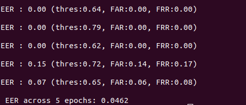

### Welcome to the SV model

1. Process your dataset
   1. Change `config/config.yaml` **unprocessed_data**
   2. Run `python data_preprocess.py`
   3. It will create `train_set` and `test_set`, each includes speakers with all his/her valid utterances
   
2. Train your model
   1. `config/config.yaml:` **model_name:**  glg
   2. `config/config.yaml:` **model.model_path:** [Empty]
   2. `config/config.yaml:` **training:** !!bool "True"
   3. `config/config.yaml:` **train.log_file:** './checkpoints/**glg_baseline**/Stats'
   4. `config/config.yaml:` **train.checkpoint_dir:** './checkpoints/**glg_baseline**'
   5. `python train_embedder_all.py`

3. Evaluate your model
   1. `config/config.yaml:` **training:** !!bool "False"
   2. `config/config.yaml:` **model.model_path:** [Your saved checkpoints here]
   3. `config/config.yaml:` **train.restore:** !!bool "True"
   4. `python train_embedder_all.py`

4. Find your EER as follows!
